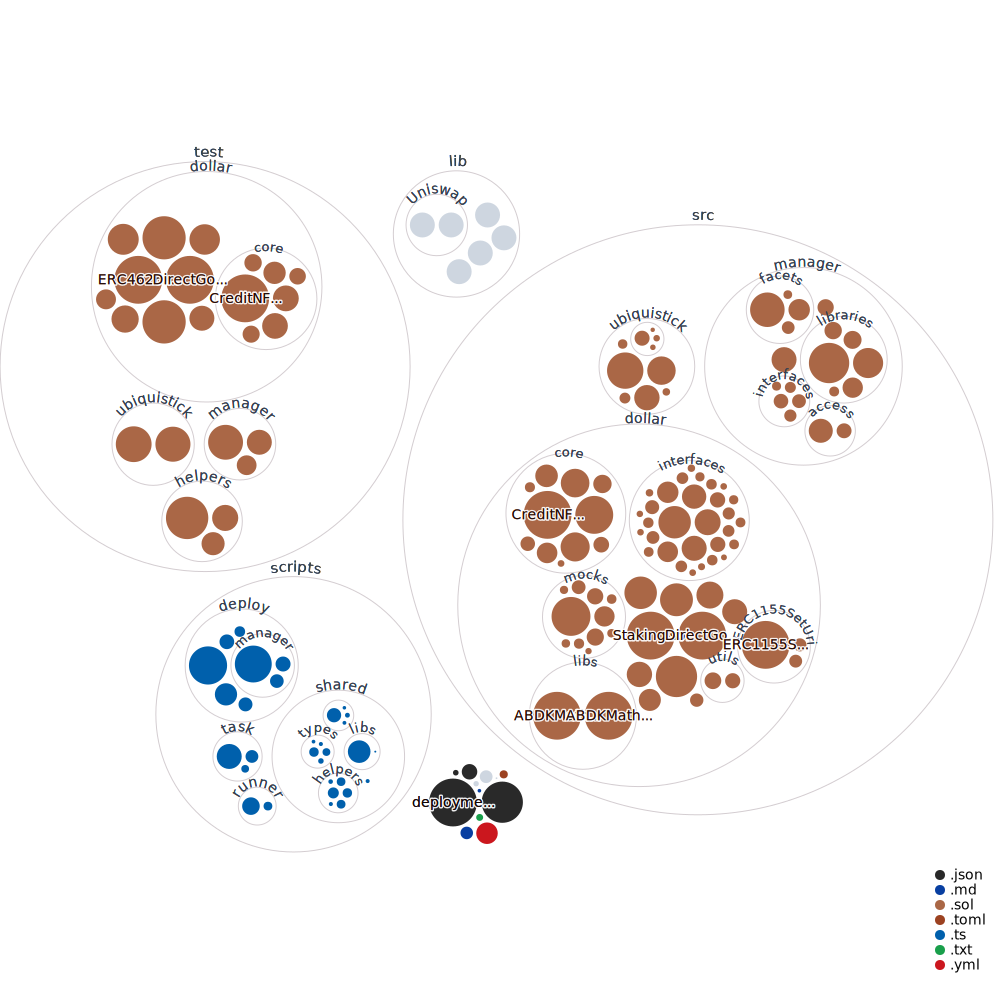
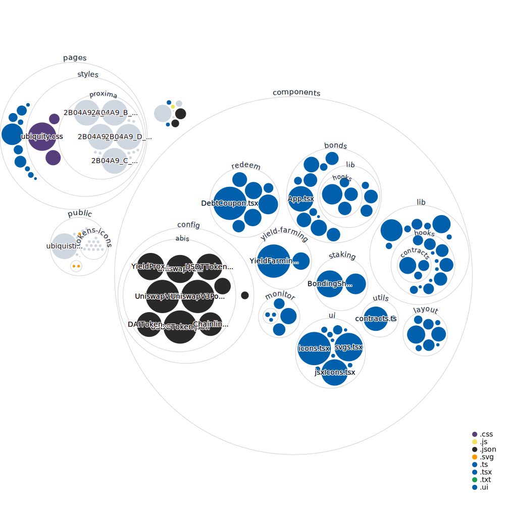

[](https://github.com/ubiquity/ubiquity-dollar/actions/workflows/build-and-test.yml)
[](https://coveralls.io/github/ubiquity/ubiquity-dollar?branch=development)
# Ubiquity Dollar
Introducing the flagship product of [Ubiquity DAO](https://ubq.fi/). The Ubiquity Dollar (uAD) is a collateralized stablecoin.
- The deployed smart contracts can be found in the [docs](https://dao.ubq.fi/smart-contracts).
- The source code for those are archived [here](https://github.com/ubiquity/uad-contracts).


## Contributing
- We welcome everybody to participate in improving the codebase and provide feedback on opened issues.
- We offer financial incentives for solved issues.
- Learn how to contribute via the DevPool [here](https://dao.ubq.fi/devpool).
## Installation
### Requirements:
- NodeJS Version >=18
- Yarn
- We use [Foundry](https://github.com/foundry-rs/foundry), check their [docs](https://book.getfoundry.sh/). Please follow their installation guide for your OS before proceeding.

### Development Setup

```sh
#!/bin/bash

git clone https://github.com/ubiquity/ubiquity-dollar.git
cd ubiquity-dollar
yarn # fetch dependencies
yarn build:all # builds the smart contracts and user interface

# Optional
yarn build:dapp # to only build the UI useful for debugging
yarn build:contracts # to only build the Smart Contracts

yarn start # starts the user interface and daemonize'd to continue to run tests in the background
yarn test:all # We run all the tests!
```

## Running workspace specific/individual commands
Using yarn workspaces, you can invoke scripts for each workspace individually.
```sh
# SCRIPT_NAME=XXX

yarn workspace @ubiquity/contracts $SCRIPT_NAME
yarn workspace @ubiquity/dapp $SCRIPT_NAME

# Some commands...

yarn workspace @ubiquity/contracts build # Build smart contracts
yarn workspace @ubiquity/contracts test # Run the smart contract unit tests

yarn workspace @ubiquity/dapp build # Build the user interface
yarn workspace @ubiquity/dapp start # Run the web application at http://localhost:3000

# check https://yarnpkg.com/features/workspaces for more yarn workspaces flexixble use cases

```
## Committing Code/Sending PRs

1. We [automatically enforce](https://github.com/conventional-changelog/commitlint) the [conventional commits](https://www.conventionalcommits.org/en/v1.0.0/) format for commit messages.

> The Conventional Commits specification is a lightweight convention on top of commit messages. It provides an easy set of rules for creating an explicit commit history; which makes it easier to write automated tools on top of.

2. We use [prettier](https://github.com/prettier/prettier), [eslint](https://github.com/eslint/eslint) and [cspell](https://github.com/streetsidesoftware/cspell) on [staged files](https://github.com/okonet/lint-staged) in order to enforce a uniform code style. Please do not circumvent these rules.

3. We require all PRs to meet the issues expectation and/or to follow the discussions accordingly and implement all necessary changes and feedback by reviewers.

4. We run [CI jobs](https://github.com/ubiquity/ubiquity-dollar/actions) all CI jobs must pass before commiting/merging a PR with no exceptions (usually a few exceptions while the PR it's getting reviewed and the maintainers highlight a job run that may skip)

5. We run Solhint to enforce a pre-set selected number of rules for code quality/style on Smart Contracts

### Network Settings
| Network | Chain ID | RPC Endpoint                  | Comment |
|---------|----------|-------------------------------|---------|
| `mainnet` | `1`        | `https://eth.ubq.fi/v1/mainnet` | Our dedicated mainnet gateway     |
| `anvil`   | `31337`    | `http://127.0.0.1:8545`         | Used for local development     |
| `sepolia` | `11155111` | `https://ethereum-sepolia.publicnode.com` |Use any public available RPC for Sepolia testing |

## Deploying Contracts (Ubiquity Dollar Core)

You need to create a new `.env` file and set all necessary env variables, example:

```sh
# Admin private key (grants access to restricted contracts methods).
# By default set to the private key from the 0x70997970c51812dc3a010c7d01b50e0d17dc79c8 address
# which is the 2nd address derived from test mnemonic "test test test test test test test test test test test junk".
ADMIN_PRIVATE_KEY="0x59c6995e998f97a5a0044966f0945389dc9e86dae88c7a8412f4603b6b78690d"

# Collateral token address (used in UbiquityPoolFacet, allows users to mint/redeem Dollars in exchange for collateral token).
# By default set to LUSD address in ethereum mainnet.
# - mainnet/anvil(forked from mainnet): 0x5f98805A4E8be255a32880FDeC7F6728C6568bA0 (LUSD)
# - testnet: 0x3e622317f8C93f7328350cF0B56d9eD4C620C5d6 (DAI)
# NOTICE: LUSD token is not deployed to sepolia testnet so we use DAI instead which is deployed to testnet
COLLATERAL_TOKEN_ADDRESS="0x5f98805A4E8be255a32880FDeC7F6728C6568bA0"

# Collateral token price feed address from chainlink.
# By default set to LUSD/USD price feed deployed on ethereum mainnet.
# - mainnet: uses already deployed LUSD/USD chainlink price feed
# - testnet/anvil: deploys LUSD/USD chainlink price feed from scratch
COLLATERAL_TOKEN_CHAINLINK_PRICE_FEED_ADDRESS="0x3D7aE7E594f2f2091Ad8798313450130d0Aba3a0"

# Curve metapool address (Dollar-3CRVLP).
# By default set to the old Dollar-3CRV metapool which is about to be redeployed when
# new Dollar token is deployed.
# - mainnet: uses old Dollar-3CRVLP address
# - testnet/anvil: deploys metapool from scratch
CURVE_DOLLAR_METAPOOL_ADDRESS="0x20955CB69Ae1515962177D164dfC9522feef567E"

# Owner private key (grants access to updating Diamond facets and setting TWAP oracle address).
# By default set to the private key from the 0xf39fd6e51aad88f6f4ce6ab8827279cfffb92266 address
# which is the 1st address derived from test mnemonic "test test test test test test test test test test test junk".
OWNER_PRIVATE_KEY="0xac0974bec39a17e36ba4a6b4d238ff944bacb478cbed5efcae784d7bf4f2ff80"

# RPC URL (used in contract migrations)
# - anvil: http://127.0.0.1:8545
# - testnet: https://ethereum-sepolia.publicnode.com
# - mainnet: https://eth.ubq.fi/v1/mainnet 
RPC_URL="http://127.0.0.1:8545"

# 3CRV LP token address (which you get if you deposit to Curve's TriPool (DAI/USDC/USDT)).
# By default set to 3CRV LP token address from mainnet.
# - mainet: uses values set in TOKEN_3CRV_ADDRESS
# - testnet/anvil: deploys 3CRV LP token from scratch
TOKEN_3CRV_ADDRESS="0x6c3F90f043a72FA612cbac8115EE7e52BDe6E490"
```

We provide an `.env.example` file pre-set with recommend testing environment variables but you are free to modify or experiment with different values on your local branch.

Then in two separate terminals run the following commands:

```sh
# starts the anvil forked mainnet/testnet network (depends on your .env config)
yarn workspace @ubiquity/contracts start:anvil

# Optional
yarn start:anvil # same as above but shorter
```

```sh
# deploys the contracts to the anvil testnet or your desired network

yarn workspace @ubiquity/contracts deploy:development

# Optional
yarn deploy:development # same as above
```

If successful it will output the accounts generated from the test mnemonic (`test test test test test test test test test test test junk`) and the port it's listening on.

## Wiki

We have a [Wiki!](https://github.com/ubiquity/ubiquity-dollar/wiki) feel free to browse it as there is a lot of useful information about the whole repo

## Yarn Workspaces

The repo has been built as a [yarn workspace](https://yarnpkg.com/features/workspaces) monorepo.

<pre>
&lt;root&gt;
├── <a href="https://github.com/ubiquity/ubiquity-dollar/tree/development/packages">packages</a>
│   ├── <a href="https://github.com/ubiquity/ubiquity-dollar/tree/development/packages/contracts">contracts</a>: Smart contracts for Ubiquity Dollar and UbiquiStick
│   ├── <a href="https://github.com/ubiquity/ubiquity-dollar/tree/development/packages/dapp">dapp</a>: User interface
</pre>

## Codebase Diagram

[Interactive Version](https://mango-dune-07a8b7110.1.azurestaticapps.net/?repo=ubiquity%2Fubiquity-dollar)

### Smart Contracts



### User Interface



---

Sine stabilitate nihil habemus.
