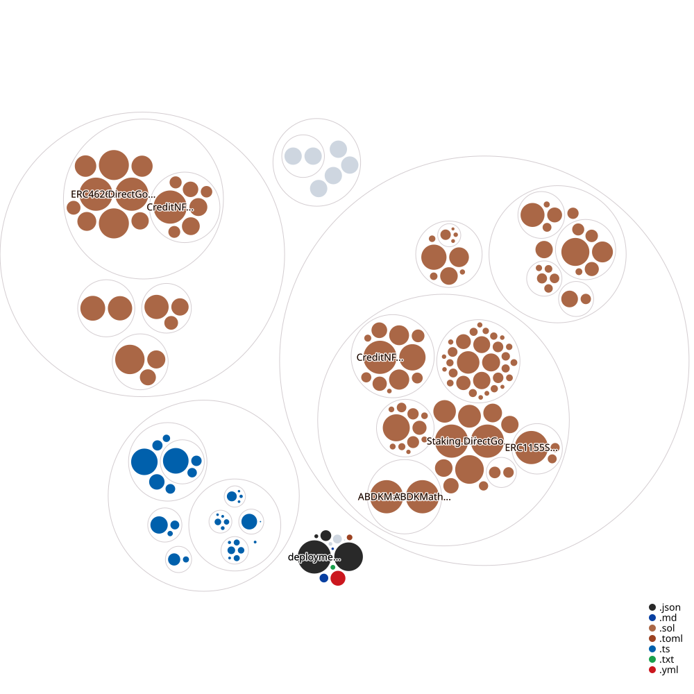
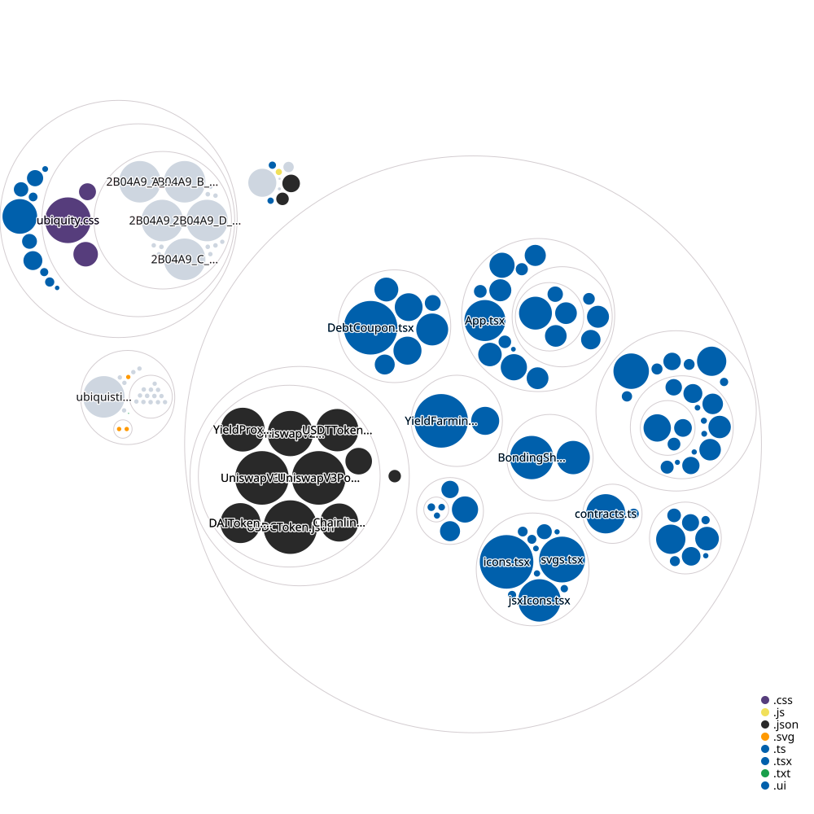

[](https://github.com/ubiquity/ubiquity-dollar/actions/workflows/build-and-test.yml)
[](https://coveralls.io/github/ubiquity/ubiquity-dollar?branch=development)
# Ubiquity Dollar
Introducing the flagship product of [Ubiquity DAO](https://ubq.fi/). The Ubiquity Dollar (UUSD) is a collateralized stablecoin.
- The deployed smart contracts can be found in the [docs](https://dao.ubq.fi/smart-contracts).
- The source code for those are archived [here](https://github.com/ubiquity/uad-contracts).
- [Dune Analytics Dashboard](https://dune.com/ubiquity_dao/ubiquity-protocol)

## Contributing
- We welcome everybody to participate in improving the codebase and provide feedback on opened issues.
- We offer financial incentives for solved issues.
- Learn how to contribute via the DevPool [here](https://dao.ubq.fi/devpool).
## Installation
### Requirements:
- NodeJS Version >=18
- Yarn
- We use [Foundry](https://github.com/foundry-rs/foundry), check their [docs](https://book.getfoundry.sh/). Please follow their installation guide for your OS before proceeding.

### Development Setup

```sh
#!/bin/bash

git clone https://github.com/ubiquity/ubiquity-dollar.git
cd ubiquity-dollar
yarn # fetch dependencies
yarn build:all # builds the smart contracts and user interface

# Optional
yarn build:dapp # to only build the UI useful for debugging
yarn build:contracts # to only build the Smart Contracts

yarn start # starts the user interface and daemonize'd to continue to run tests in the background
yarn test:all # We run all the tests!
```

## Running workspace specific/individual commands
Using yarn workspaces, you can invoke scripts for each workspace individually.
```sh
# SCRIPT_NAME=XXX

yarn workspace @ubiquity/contracts $SCRIPT_NAME
yarn workspace @ubiquity/dapp $SCRIPT_NAME

# Some commands...

yarn workspace @ubiquity/contracts build # Build smart contracts
yarn workspace @ubiquity/contracts test # Run the smart contract unit tests

yarn workspace @ubiquity/dapp build # Build the user interface
yarn workspace @ubiquity/dapp start # Run the web application at http://localhost:3000

# check https://yarnpkg.com/features/workspaces for more yarn workspaces flexixble use cases

```
## Committing Code/Sending PRs

1. We [automatically enforce](https://github.com/conventional-changelog/commitlint) the [conventional commits](https://www.conventionalcommits.org/en/v1.0.0/) format for commit messages.

> The Conventional Commits specification is a lightweight convention on top of commit messages. It provides an easy set of rules for creating an explicit commit history; which makes it easier to write automated tools on top of.

2. We use [prettier](https://github.com/prettier/prettier), [eslint](https://github.com/eslint/eslint) and [cspell](https://github.com/streetsidesoftware/cspell) on [staged files](https://github.com/okonet/lint-staged) in order to enforce a uniform code style. Please do not circumvent these rules.

3. We require all PRs to meet the issues expectation and/or to follow the discussions accordingly and implement all necessary changes and feedback by reviewers.

4. We run [CI jobs](https://github.com/ubiquity/ubiquity-dollar/actions) all CI jobs must pass before committing/merging a PR with no exceptions (usually a few exceptions while the PR it's getting reviewed and the maintainers highlight a job run that may skip)

5. We run Solhint to enforce a pre-set selected number of rules for code quality/style on Smart Contracts

### Network Settings
| Network | Chain ID | RPC Endpoint                  | Comment |
|---------|----------|-------------------------------|---------|
| `mainnet` | `1`        | `https://rpc.ankr.com/eth` | Public Mainnet Gateway    |
| `anvil`   | `31337`    | `http://127.0.0.1:8545`         | Used for local development     |
| `sepolia` | `11155111` | `https://ethereum-sepolia.publicnode.com` |Use any public available RPC for Sepolia testing |

## Deploying Contracts (Ubiquity Dollar Core)

You need to create a new `.env` file and set all necessary env variables, example:

```sh
# Admin private key (grants access to restricted contracts methods).
# By default set to the private key from the 0x70997970c51812dc3a010c7d01b50e0d17dc79c8 address
# which is the 2nd address derived from test mnemonic "test test test test test test test test test test test junk".
ADMIN_PRIVATE_KEY="0x59c6995e998f97a5a0044966f0945389dc9e86dae88c7a8412f4603b6b78690d"

# Collateral token address (used in UbiquityPoolFacet, allows users to mint/redeem Dollars in exchange for collateral token).
# By default set to LUSD address in ethereum mainnet.
# - mainnet: 0x5f98805A4E8be255a32880FDeC7F6728C6568bA0 (LUSD)
# - testnet/anvil: deploys collateral ERC20 token from scratch
COLLATERAL_TOKEN_ADDRESS="0x5f98805A4E8be255a32880FDeC7F6728C6568bA0"

# Collateral token price feed address from chainlink.
# By default set to LUSD/USD price feed deployed on ethereum mainnet.
# This price feed is used in 2 cases:
# 1) To calculate collateral price in USD
# 2) To calculate Dollar price in USD
# Since collateral token (LUSD) is the same one used in Curve's plain pool (LUSD-Dollar)
# we share the same price feed in:
# 1) `LibUbiquityPool.setCollateralChainLinkPriceFeed()` (to calculate collateral price in USD)
# 2) `LibUbiquityPool.setStableUsdChainLinkPriceFeed()` (to calculate Dollar price in USD)
# - mainnet: uses already deployed LUSD/USD chainlink price feed
# - testnet/anvil: deploys LUSD/USD chainlink price feed from scratch
COLLATERAL_TOKEN_CHAINLINK_PRICE_FEED_ADDRESS="0x3D7aE7E594f2f2091Ad8798313450130d0Aba3a0"

# Curve's Governance/WETH pool address.
# Used to fetch Governance/ETH price from built-in oracle.
# By default set to already deployed (production ready) Governance/WETH pool address.
# - mainnet: uses already deployed Governance/ETH pool address
# - testnet/anvil: deploys Governance/WETH pool from scratch
CURVE_GOVERNANCE_WETH_POOL_ADDRESS="0xaCDc85AFCD8B83Eb171AFFCbe29FaD204F6ae45C"

# Chainlink price feed address for ETH/USD pair.
# Used to calculate Governance token price in USD.
# By default set to ETH/USD price feed deployed on ethereum mainnet.
# - mainnet: uses already deployed ETH/USD chainlink price feed
# - testnet/anvil: deploys ETH/USD chainlink price feed from scratch
ETH_USD_CHAINLINK_PRICE_FEED_ADDRESS="0x5f4eC3Df9cbd43714FE2740f5E3616155c5b8419"

# Dollar amount in wei minted initially to owner to provide liquidity to the Curve LUSD-Dollar plain pool
# By default set to 25k Dollar tokens
INITIAL_DOLLAR_MINT_AMOUNT_WEI="25000000000000000000000"

# Owner private key (grants access to updating Diamond facets and setting TWAP oracle address).
# By default set to the private key from the 0xf39fd6e51aad88f6f4ce6ab8827279cfffb92266 address
# which is the 1st address derived from test mnemonic "test test test test test test test test test test test junk".
OWNER_PRIVATE_KEY="0xac0974bec39a17e36ba4a6b4d238ff944bacb478cbed5efcae784d7bf4f2ff80"

# RPC URL (used in contract migrations)
# - anvil: http://127.0.0.1:8545
# - testnet: https://sepolia.gateway.tenderly.co
# - mainnet: https://mainnet.gateway.tenderly.co
RPC_URL="http://127.0.0.1:8545"
```

We provide an `.env.example` file pre-set with recommend testing environment variables but you are free to modify or experiment with different values on your local branch.

Then in two separate terminals run the following commands:

```sh
# starts the anvil forked mainnet/testnet network (depends on your .env config)
yarn workspace @ubiquity/contracts start:anvil

# Optional
yarn start:anvil # same as above but shorter
```

```sh
# deploys the contracts to the anvil testnet or your desired network

yarn workspace @ubiquity/contracts deploy:development

# Optional
yarn deploy:development # same as above
```

If successful it will output the accounts generated from the test mnemonic (`test test test test test test test test test test test junk`) and the port it's listening on.

## Our Official Deployments

### Ethereum Mainnet

| Contract                         | Address                                                                                                               |
|----------------------------------|-----------------------------------------------------------------------------------------------------------------------|
| Diamond                          | [0xED3084c98148e2528DaDCB53C56352e549C488fA](https://etherscan.io/address/0xED3084c98148e2528DaDCB53C56352e549C488fA) |
| AccessControlFacet               | [0xe17a61e55ccbc3d1e56b6a26ea1d4f8382a40ad9](https://etherscan.io/address/0xe17a61e55ccbc3d1e56b6a26ea1d4f8382a40ad9) |
| DiamondCutFacet                  | [0xd3c81bd07948a38546bca894f8bfecb552613798](https://etherscan.io/address/0xd3c81bd07948a38546bca894f8bfecb552613798) |
| DiamondLoupeFacet                | [0xd11b60c336a8416162272475ff9df572e516fc51](https://etherscan.io/address/0xd11b60c336a8416162272475ff9df572e516fc51) |
| ManagerFacet                     | [0x0e9f3299b9443d3d5130771f26b7e18a2a7aa9db](https://etherscan.io/address/0x0e9f3299b9443d3d5130771f26b7e18a2a7aa9db) |
| OwnershipFacet                   | [0x58860e93b6fc7a6e4abd0f5d851a88654a34d0c0](https://etherscan.io/address/0x58860e93b6fc7a6e4abd0f5d851a88654a34d0c0) |
| UbiquityPoolFacet                | [0xb64f2347752192f51930ad6ad3bea0b3a2074fac](https://etherscan.io/address/0xb64f2347752192f51930ad6ad3bea0b3a2074fac) |
| UbiquityDollarToken              | [0xb6919Ef2ee4aFC163BC954C5678e2BB570c2D103](https://etherscan.io/address/0xb6919Ef2ee4aFC163BC954C5678e2BB570c2D103) |
| UbiquityGovernanceToken          | [0x4e38D89362f7e5db0096CE44ebD021c3962aA9a0](https://etherscan.io/address/0x4e38D89362f7e5db0096CE44ebD021c3962aA9a0) |
| UbiquityAlgorithmicDollarManager | [0x4DA97a8b831C345dBe6d16FF7432DF2b7b776d98](https://etherscan.io/address/0x4DA97a8b831C345dBe6d16FF7432DF2b7b776d98) |
| BondingV2                        | [0xc251ecd9f1bd5230823f9a0f99a44a87ddd4ca38](https://etherscan.io/address/0xc251ecd9f1bd5230823f9a0f99a44a87ddd4ca38) |
| BondingShareV2                   | [0x2da07859613c14f6f05c97efe37b9b4f212b5ef5](https://etherscan.io/address/0x2da07859613c14f6f05c97efe37b9b4f212b5ef5) |
| MasterChefV2.1                   | [0xdae807071b5ac7b6a2a343bead19929426dbc998](https://etherscan.io/address/0xdae807071b5ac7b6a2a343bead19929426dbc998) |
| Treasury                         | [0xefC0e701A824943b469a694aC564Aa1efF7Ab7dd](https://etherscan.io/address/0xefC0e701A824943b469a694aC564Aa1efF7Ab7dd) |
| LUSD/UUSD Curve Pool             | [0xcc68509f9ca0e1ed119eac7c468ec1b1c42f384f](https://etherscan.io/address/0xcc68509f9ca0e1ed119eac7c468ec1b1c42f384f) |
| UBQ/WETH Curve Pool              | [0xacdc85afcd8b83eb171affcbe29fad204f6ae45c](https://etherscan.io/address/0xacdc85afcd8b83eb171affcbe29fad204f6ae45c) |

### Gnosis Chain

| Contract                 | Address                                                                                                                |
|--------------------------|------------------------------------------------------------------------------------------------------------------------|
| UbiquityDollarToken.sol  | [0xc6ed4f520f6a4e4dc27273509239b7f8a68d2068](https://gnosisscan.io/address/0xc6ed4f520f6a4e4dc27273509239b7f8a68d2068) |
| Treasury                 | [0xefC0e701A824943b469a694aC564Aa1efF7Ab7dd](https://gnosisscan.io/address/0xefC0e701A824943b469a694aC564Aa1efF7Ab7dd) |
| WXDAI/UUSD Curve Pool    | [0xf3e3376B15aCA6dC3852B131B7dE4851754062eB](https://gnosisscan.io/address/0xf3e3376b15aca6dc3852b131b7de4851754062eb) |

For more information about deployments please refer to the [smart contracts wiki page](https://github.com/ubiquity/ubiquity-dollar/wiki/24.-Smart-Contracts). For an extended list of deprecated deployments, please visit [this page](https://github.com/ubiquity/ubiquity-dollar/wiki/25.-Deprecated-Deployments). 

## Wiki

We have a [Wiki!](https://github.com/ubiquity/ubiquity-dollar/wiki) feel free to browse it as there is a lot of useful information about the whole repo

## Yarn Workspaces

The repo has been built as a [yarn workspace](https://yarnpkg.com/features/workspaces) monorepo.

<pre>
&lt;root&gt;
├── <a href="https://github.com/ubiquity/ubiquity-dollar/tree/development/packages">packages</a>
│   ├── <a href="https://github.com/ubiquity/ubiquity-dollar/tree/development/packages/contracts">contracts</a>: Smart contracts for Ubiquity Dollar and UbiquiStick
│   ├── <a href="https://github.com/ubiquity/ubiquity-dollar/tree/development/packages/dapp">dapp</a>: User interface
</pre>

## Codebase Diagram

[Interactive Version](https://mango-dune-07a8b7110.1.azurestaticapps.net/?repo=ubiquity%2Fubiquity-dollar)

### Smart Contracts



### User Interface



---

### Audits

2024 - [Sherlock](https://github.com/ubiquity/ubiquity-dollar/blob/development/packages/contracts/audits/ubiquity-audit-report-sherlock.pdf)

Sine stabilitate nihil habemus.
